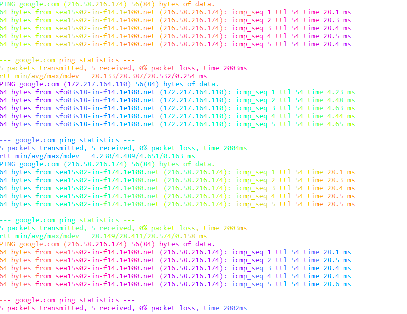

# lolgoogle

A simple shell script that pings Google and displays the output using lolcat.

## Description

`lolgoogle` is a bash script that combines the functionality of `ping` with the colorful output of `lolcat`. It sends ICMP packets to Google's servers and displays the results in a rainbow of colors.



## Installation

1. Clone the repository:
```bash
git clone https://github.com/patfedigan/lolgoogle.git
cd lolgoogle
```

2. Make sure you have lolcat installed:
```bash
# On Debian/Ubuntu
sudo apt-get install lolcat

# On macOS with Homebrew
brew install lolcat
```

3. Make the script executable:
```bash
chmod +x lolgoogle.sh
```

## Usage

Simply run the script:
```bash
./lolgoogle.sh
```

To stop the script, press `Ctrl+C`.

## Requirements

- bash
- ping
- lolcat

## License

MIT


